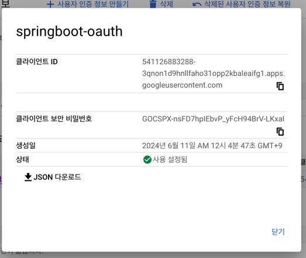

### 기술 스택 정리

#### 빌드 도구
- **Gradle**

#### 언어
- **Java 17**

#### 프레임워크
- **Spring Boot 3.3.1**

#### 데이터베이스
- **H2 Database**: 인메모리 데이터베이스
- **MySQL Connector**: MySQL 드라이버

---

#### JAVADOC 
- @param: 메서드 매개변수를 설명합니다. 
- @return: 메서드의 반환 값을 설명합니다. 
- @throws 또는 @exception: 메서드가 던질 수 있는 예외를 설명합니다. 
- @see: 참조할 다른 클래스나 메서드를 설명합니다. 
- @deprecated: 더 이상 사용되지 않는 클래스나 메서드를 설명합니다.

